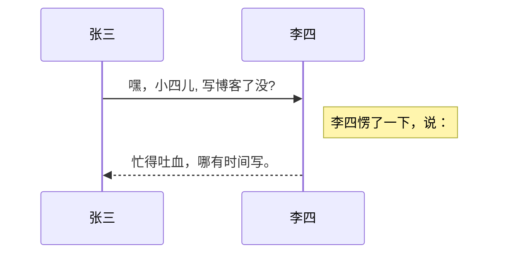

## Welcome to GitHub Pages

You can use the [editor on GitHub](https://github.com/hyperbola7/test/edit/gh-pages/index.md) to maintain and preview the content for your website in Markdown files.

Whenever you commit to this repository, GitHub Pages will run [Jekyll](https://jekyllrb.com/) to rebuild the pages in your site, from the content in your Markdown files.

### Markdown

Markdown is a lightweight and easy-to-use syntax for styling your writing. It includes conventions for

```markdown
Syntax highlighted code block

# Header 1
## Header 2
### Header 3

- Bulleted
- List

1. Numbered
2. List

**Bold** and _Italic_ and `Code` text

[Link](url) and 
```

For more details see [GitHub Flavored Markdown](https://guides.github.com/features/mastering-markdown/).

### Jekyll Themes

Your Pages site will use the layout and styles from the Jekyll theme you have selected in your [repository settings](https://github.com/hyperbola7/test/settings). The name of this theme is saved in the Jekyll `_config.yml` configuration file.

### Support or Contact

Having trouble with Pages? Check out our [documentation](https://docs.github.com/categories/github-pages-basics/) or [contact support](https://github.com/contact) and we’ll help you sort it out.

# Hello World! 
oo
j
## dd
$$ J_\alpha(x) = \sum_{m=0}^\infty \frac{(-1)^m}{m! \Gamma (m + \alpha + 1)} {\left({ \frac{x}{2} }\right)}^{2m + \alpha} \text {，行内公式示例} $$
$$\frac{7x+5}{1+y^2} $$
# sa
    当我们
    hyperbola 
## sd

## vsd
# 

$$
\begin{matrix}
1 & 2 & 3 \\
4 & 5 & 6 \\
7 & 8 & 9 
\end{matrix} \tag{1}
$$

$$
V(r)  = -\frac{Ar^3}{12\epsilon_0} - \frac{C_1}{r} + C_2 \tag{1}
$$

$$ 
\sum_{m=1}^\infty
$$

$x^{y^z}=(1+e^x)^{-2xy^w}$

$\sum_{1}^n\frac{1}{x^2}$

$\prod_{i=0}^n\frac{1}{x^2}$

| Tables        | Are           | Cool  |
| ------------- |:-------------:| -----:|
| col 3 is      | right-aligned | $1600 |
| col 2 is      | centered      |   $12 |

$\vec{a} \cdot \vec{b}=0$

$f(x_1, x_2, \ldots, x_n)=x_1^2 + x_2^2+ \cdots + x_n^2$

可以渲染序列图：



$$f(x)=a^2 \tag{"hello"}$$
$\alpha,\gamma,H,\geq$

支持四十一种编程语言的语法高亮的显示，行号显示。

非代码示例：

```
$ sudo apt-get install vim-gnome
```

Python 示例：

```python
@requires_authorization
def somefunc(param1='', param2=0):
    '''A docstring'''
    if param1 > param2: # interesting
        print 'Greater'
    return (param2 - param1 + 1) or None

class SomeClass:
    pass

>>> message = '''interpreter
... prompt'''
```

JavaScript 示例：

``` javascript
/**
* nth element in the fibonacci series.
* @param n >= 0
* @return the nth element, >= 0.
*/
function fib(n) {
  var a = 1, b = 1;
  var tmp;
  while (--n >= 0) {
    tmp = a;
    a += b;
    b = tmp;
  }
  return a;
}

document.write(fib(10));
``` 